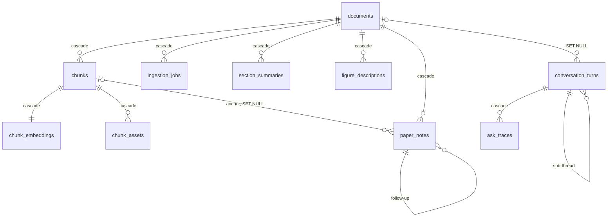

# Database schema

> **What this is:** every table and column, with the relationships between them. Look-up only.
>
> **Owns:** table/column meanings and FK behavior.
> **Does not own:** how the schema is applied ([migrations.md](migrations.md)), what the data
> means in flow ([overview.md](../02-architecture/overview.md)).
>
> **Status:** current · **Last verified:** 2026-07-25 against
> [`database/schema.sql`](../../backend/app/database/schema.sql) (`main`, 9b75500)
> **Verify with:** `\d+ <table>` in psql — the live database is authoritative
>
> ⚠ One FK deviates from the pattern: `conversation_turns.document_id` is `ON DELETE SET NULL`,
> not `CASCADE`, so chat history survives paper deletion. Everything else cascades.

Canonical schema is in [database/schema.sql](../../backend/app/database/schema.sql).
It is applied on startup by [database/migrations.py](../../backend/app/database/migrations.py)
(idempotent `CREATE TABLE IF NOT EXISTS …`).

Two Postgres extensions are required: `vector` (pgvector) and `uuid-ossp`.

## ERD

```
documents (1) ─────< (N) chunks ─────────< (1) chunk_embeddings
                        │ \───< (N) chunk_assets
                        │ \───< (N) figure_descriptions
                        ▲
                        │
            conversation_turns ──< (1) ask_traces
            conversation_turns ── parent_turn_id → conversation_turns.id (sub-threads)

documents (1) ─────< (N) ingestion_jobs
documents (1) ─────< (N) section_summaries
documents (1) ─────< (N) figure_descriptions
documents (1) ─────< (N) paper_notes
            paper_notes ── anchor_chunk_id → chunks.id  (SET NULL)
            paper_notes ── parent_note_id  → paper_notes.id (follow-ups)
```

### (rendered)



All FKs use `ON DELETE CASCADE` except `conversation_turns.document_id`
which uses `SET NULL` (so a chat about a deleted paper survives).

## Tables

### `documents`

The library row.

| Column                      | Type        | Notes                                                 |
| --------------------------- | ----------- | ----------------------------------------------------- |
| `id`                        | `UUID`      | PK, server-generated.                                 |
| `filename`                  | `TEXT`      | The opaque `<uuid>.pdf` on disk under `documents/`.   |
| `original_filename`         | `TEXT`      | What the user uploaded (used by `/raw`).              |
| `file_size_bytes`           | `BIGINT`    |                                                       |
| `page_count`                | `INTEGER`   | Set by `pypdf` after pipeline completes.              |
| `status`                    | `TEXT`      | `queued / complete / failed`.                         |
| `error_message`             | `TEXT`      | Last failure message.                                 |
| `reading_order`             | `JSONB`     | LLM-corrected sequence of chunk sequence_ids.         |
| `reading_order_model`       | `TEXT`      |                                                       |
| `reading_order_updated_at`  | `TIMESTAMPTZ` |                                                     |
| `extractor`                 | `TEXT`      | `mineru` or `pymupdf_fallback`.                      |
| `doc_kind`                  | `TEXT`      | `paper` (default) or `book`. Chosen at upload; decides which reader opens it and which ingest chain it takes. |
| `embedding_mode`            | `TEXT`      | `embedded` (default) or `skipped`. Decided once at ingestion, never re-derived. |
| `embedding_skip_reason`     | `TEXT`      | Why, for audit: `fast_ingest`, `fits(N<=M)`, `too_large(...)`, `feature_disabled`. |
| `created_at`                | `TIMESTAMPTZ` | `DEFAULT NOW()`.                                    |
| `updated_at`                | `TIMESTAMPTZ` | Bumped by `update_document_status`.                 |

### `chunks`

One row per structural unit (heading, paragraph, math, table, figure).

| Column               | Type       | Notes                                       |
| -------------------- | ---------- | ------------------------------------------- |
| `id`                 | `UUID`     | PK.                                         |
| `document_id`        | `UUID`     | FK → `documents.id`, cascade delete.        |
| `sequence_id`        | `INTEGER`  | 1-based reading order within the document.  |
| `parent_sequence_id` | `INTEGER`  | Reserved for nested structures.             |
| `chunk_type`         | `TEXT`     | `text / heading / math / table / figure / footnote`. |
| `heading_path`       | `TEXT[]`   | Breadcrumb from H1 to current heading.      |
| `markdown`           | `TEXT`     | Normalized markdown body.                   |
| `plain_text`         | `TEXT`     | What we embed.                              |
| `page_start`         | `INTEGER`  | Currently nullable.                         |
| `page_end`           | `INTEGER`  | Currently nullable.                         |
| `bbox_json`          | `JSONB`    | Reserved for bounding boxes.                |
| `token_count`        | `INTEGER`  | `≈ len(plain_text) / 4`.                    |
| `table_json`         | `JSONB`    | Structured table data for `chunk_type='table'`. |
| `created_at`         | `TIMESTAMPTZ` |                                          |

Unique constraint: `(document_id, sequence_id)`.
Index: `idx_chunks_document_sequence(document_id, sequence_id)`.

### `chunk_embeddings`

A 1:1 sidecar to `chunks`. Separate table so heavy embedding rows can be
loaded only when needed.

| Column            | Type           | Notes                                |
| ----------------- | -------------- | ------------------------------------ |
| `chunk_id`        | `UUID`         | PK, FK → `chunks.id`, cascade.       |
| `embedding`       | `vector(N)` | N = `VECTOR_DIMENSION` env (default 1024); changing it re-embeds the library. |
| `embedding_model` | `TEXT`         | Name of the embedding model used.    |
| `created_at`      | `TIMESTAMPTZ`  |                                      |

Cosine search: `ORDER BY embedding <=> :query_embedding`.

### `chunk_assets`

Images extracted from MinerU output, linked back to the chunk that
referenced them.

| Column       | Type       | Notes                                           |
| ------------ | ---------- | ----------------------------------------------- |
| `id`         | `UUID`     | PK.                                             |
| `chunk_id`   | `UUID`     | FK → `chunks.id`, cascade.                      |
| `asset_type` | `TEXT`     | `image`, etc.                                   |
| `file_path`  | `TEXT`     | **Relative** to `images_dir()`. Served at `/static/images/<file_path>`. |
| `mime_type`  | `TEXT`     |                                                 |
| `width`      | `INTEGER`  | Currently null.                                 |
| `height`     | `INTEGER`  | Currently null.                                 |
| `caption`    | `TEXT`     | Currently null.                                 |
| `created_at` | `TIMESTAMPTZ` |                                              |

Index: `idx_chunk_assets_chunk_id(chunk_id)`.

### `conversation_turns`

The append-only chat log.

| Column            | Type          | Notes                                            |
| ----------------- | ------------- | ------------------------------------------------ |
| `id`              | `UUID`        | PK.                                              |
| `conversation_id` | `UUID`        | Groups turns into a thread.                      |
| `document_id`     | `UUID` (null) | FK → `documents.id`, **`SET NULL`** on delete.   |
| `parent_turn_id`  | `UUID` (null) | FK → `conversation_turns.id` cascade (sub-threads). |
| `role`            | `TEXT`        | `user / assistant / compaction`.                 |
| `content`         | `TEXT`        | The prompt or the answer.                        |
| `context_type`    | `TEXT`        | `LOCAL / GLOBAL / OVERVIEW / EXTERNAL / OUT_OF_SCOPE / COMPACTION`. |
| `router_reason`   | `TEXT`        | Why the router picked this context.              |
| `model`           | `TEXT`        | The actual model name the LLM returned.          |
| `citations`       | `JSONB`       | JSON-serialized list of `Citation` dicts.        |
| `created_at`      | `TIMESTAMPTZ` |                                                  |

Index: `idx_conversation_turns_conversation(conversation_id, created_at)`.

### `ask_traces`

Per-call telemetry attached to the assistant turn.

| Column                  | Type          | Notes                                           |
| ----------------------- | ------------- | ----------------------------------------------- |
| `id`                    | `UUID`        | PK.                                             |
| `conversation_turn_id`  | `UUID`        | FK → `conversation_turns.id`, cascade.          |
| `context_type`          | `TEXT`        |                                                 |
| `router_reason`         | `TEXT`        |                                                 |
| `retrieved_chunk_ids`   | `UUID[]`      | Currently always null — reserved.               |
| `model`                 | `TEXT`        |                                                 |
| `prompt_tokens`         | `INTEGER`     | From Ollama.                                    |
| `completion_tokens`     | `INTEGER`     |                                                 |
| `latency_ms`            | `INTEGER`     | Wall-clock time inside `handle_ask`.            |
| `created_at`            | `TIMESTAMPTZ` |                                                 |

### `ingestion_jobs`

One row per upload; tracks the pipeline state machine.

| Column          | Type          | Notes                                                  |
| --------------- | ------------- | ------------------------------------------------------ |
| `id`            | `UUID`        | PK.                                                    |
| `document_id`   | `UUID`        | FK → `documents.id`, cascade.                          |
| `status`        | `TEXT`        | `queued / extracting / chunking / embedding / summarizing / complete / failed`. |
| `error_message` | `TEXT`        |                                                        |
| `started_at`    | `TIMESTAMPTZ` | Set on first non-queued transition (idempotent).       |
| `completed_at`  | `TIMESTAMPTZ` | Set on `complete` or `failed`.                         |
| `created_at`    | `TIMESTAMPTZ` |                                                        |

Index: `idx_ingestion_jobs_status(status)`.

### `section_summaries`

Pre-computed hierarchical overviews used by the OVERVIEW chat route.

| Column                | Type          | Notes                                             |
| --------------------- | ------------- | ------------------------------------------------- |
| `id`                  | `UUID`        | PK.                                               |
| `document_id`         | `UUID`        | FK → `documents.id` cascade.                      |
| `section_id`          | `TEXT`        | Stable ID (e.g. `h1-03-introduction`).            |
| `level`               | `INTEGER`     | `0` = whole paper, `1` = H1, `2` = H2.            |
| `heading_path`        | `TEXT[]`      | Heading breadcrumb.                               |
| `sequence_start`      | `INTEGER`     | Inclusive source sequence range.                  |
| `sequence_end`        | `INTEGER`     |                                                    |
| `summary_markdown`    | `TEXT`        | LLM-generated summary.                            |
| `summary_plain`       | `TEXT`        | Plain-text version.                               |
| `source_chunk_ids`    | `UUID[]`      | Chunk IDs fed to the LLM (citations).             |
| `model`               | `TEXT`        |                                                    |
| `prompt_hash`         | `TEXT`        | Hash of prompt template + version.                |
| `created_at`          | `TIMESTAMPTZ` |                                                    |

`UNIQUE(document_id, section_id, model)`.

### `figure_descriptions`

VLM-generated technical descriptions of figures/diagrams.

| Column                       | Type          | Notes                                    |
| ---------------------------- | ------------- | ---------------------------------------- |
| `id`                         | `UUID`        | PK.                                      |
| `document_id`                | `UUID`        | FK → `documents.id` cascade.             |
| `chunk_id`                   | `UUID`        | FK → `chunks.id` cascade.                |
| `image_path`                 | `TEXT`        | Relative path under `images/`.           |
| `description_markdown`       | `TEXT`        | VLM-generated description.               |
| `description_plain`          | `TEXT`        | Plain-text version.                      |
| `source_sequence_start`      | `INTEGER`     |                                          |
| `source_sequence_end`        | `INTEGER`     |                                          |
| `referenced_by_chunk_ids`    | `UUID[]`      | Text chunks that mention this figure.    |
| `model`                      | `TEXT`        | eg. `gemma4:31b-cloud` (the resolved chat/VLM model at generation time).                    |
| `prompt_hash`                | `TEXT`        |                                          |
| `created_at`                 | `TIMESTAMPTZ` |                                          |

`UNIQUE(chunk_id, model)`.

⚠ Only populated under `INGEST_PROFILE=full`. The fast profile never runs the VLM pass — a
question about a figure hands the image to the model live instead.

### `paper_notes`

One question the reader asked about a specific place in a paper, plus its answer. The margin
annotations that replaced the side chat pane.

⚠ Deliberately **not** `conversation_turns`. A note is anchored to a location, is a single Q+A
rather than a rolling transcript, and none of the conversation machinery (routing, compaction,
sub-threads) applies. Sharing that table would give every note five columns it never uses and
surface notes in the chat-history endpoints.

| Column                 | Type          | Notes                                                     |
| ---------------------- | ------------- | --------------------------------------------------------- |
| `id`                   | `UUID`        | PK.                                                        |
| `document_id`          | `UUID`        | FK → `documents.id` cascade.                              |
| `anchor_chunk_id`      | `UUID`        | FK → `chunks.id` **SET NULL**. A convenience, not the anchor. |
| `anchor_sequence_id`   | `INTEGER`     | **The durable anchor.** What the margin positions by.      |
| `anchor_kind`          | `TEXT`        | `text` (highlighted passage) / `figure` / `equation` / `block` (no selection — anchored to what was in view). |
| `anchor_quote`         | `TEXT`        | The exact highlighted text; re-located in the DOM to repaint the highlight. For an equation, its LaTeX. |
| `anchor_image_path`    | `TEXT`        | Relative path under `images/` for figure and equation anchors. |
| `question`             | `TEXT`        |                                                            |
| `answer`               | `TEXT`        | `''` until generation completes — a failed call leaves a visible, retryable card. |
| `cited_sequence_ids`   | `INTEGER[]`   | Blocks the answer referenced via `[[42]]` markers; renders as jump chips. |
| `retrieval_mode`       | `TEXT`        | `whole` (paper fit in context) or `agent` (SEARCH/READ loop ran). |
| `model`                | `TEXT`        | What the provider reported answering.                      |
| `requested_model`      | `TEXT`        | What the reader picked. Authoritative for follow-ups.      |
| `margin_side`          | `TEXT`        | `right` (default) or `left`.                               |
| `parent_note_id`       | `UUID`        | FK → `paper_notes.id` cascade. Follow-ups chain here.      |
| `created_at`           | `TIMESTAMPTZ` |                                                            |

⚠ `anchor_chunk_id` is `SET NULL` rather than `CASCADE` on purpose. Re-chunking deletes every
chunk row, so cascading would delete the reader's notes along with them. `anchor_sequence_id`
survives, so a re-chunk degrades an anchor's precision instead of destroying the note.

Indexes: `(document_id, anchor_sequence_id, created_at)` — the exact order the margin lays cards
out in — and `(parent_note_id)` for thread loading.

## Status state machines

**`documents.status`**

```
queued ──► complete
      └──► failed
```

**`ingestion_jobs.status`** — the path depends on `INGEST_PROFILE` and `doc_kind`.

```
                                    ┌─ fast profile + doc_kind='paper' ─┐
queued → extracting → chunking ─────┴──────────────────────────────────► complete
                          │
                          ├─ full profile ──► embedding ──► summarizing ──► complete
                          │
                          └─ paper-only skip ─────────────► summarizing ──► complete

any state ─────────────────────────────────────────────────────────────► failed
```

⚠ `chunking → complete` is the fast path, and it is the one place other than
`generate_section_summaries` that sets completion. That is safe only because nothing is
dispatched afterwards — see
[`pipeline_sync.py`](../../backend/app/extraction/pipeline_sync.py).